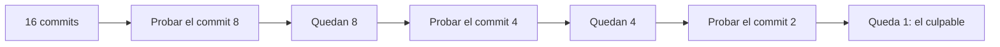

# Investigación y Criterio

## 1. Investigación previa estructurada

Antes de escalar un bloqueo a tu Senior, tienes que llegar con:

1. El problema bien diagnosticado (qué pasa, cuándo, es reproducible o no).
2. Al menos 2-3 alternativas de solución evaluadas, con sus [tradeoffs](./05-que-son-los-tradeoffs.md).
3. Por qué elegiste (o descartaste) cada una.

Esto no es "hacer bien los deberes antes de pedir ayuda" por formalismo — es la diferencia entre gastar 5 minutos del tiempo de tu Senior o gastar 40. Con contexto armado, la respuesta que te dan es específica y accionable. Sin contexto, te terminan re-investigando el problema desde cero.

**Plantilla mental para escalar:**

- **Contexto:** ¿qué intentás lograr?
- **Síntoma:** ¿qué está pasando en vez de lo esperado?
- **Lo que probé:** alternativa A (resultado X), alternativa B (resultado Y).
- **Mi hipótesis:** creo que es esto porque...
- **Pregunta concreta:** ¿esto tiene sentido o me estoy perdiendo algo?

## 2. Git como herramienta de debugging

Git no es solo para versionar, es una herramienta de investigación cuando algo "andaba bien la semana pasada y ahora no".

### git bisect

Sirve para encontrar EN QUÉ COMMIT se rompió algo, mediante búsqueda binaria automática.

```bash
git bisect start
git bisect bad                # el commit actual está roto
git bisect good v1.2.0        # ese commit andaba bien

# se va parando en commits intermedios, se prueba y se marca:
git bisect good   # si anda bien
git bisect bad    # si sigue roto

# al final te dice el commit exacto que introdujo el bug
git bisect reset  # termina la sesión
```

Con 10 commits de diferencia, `bisect` te resuelve el "¿cuál fue?" en ~4 pasos (log₂ 10) en vez de revisar uno por uno.

Ejemplo con 16 commits sospechosos, mostrando un camino posible (en cada paso podría salir bien o mal, pero siempre se descarta la mitad):



### git blame

Te dice quién tocó una línea específica por última vez, y en qué commit.

```bash
git blame PedidoService.cs -L 40,60
```

Útil para entender el CONTEXTO de por qué una línea está como está, antes de tocarla a ciegas.

### git log -p

Muestra el historial de cambios de un archivo, con el diff de cada commit.

```bash
git log -p --follow PedidoService.cs
```

`--follow` sirve para seguir el historial incluso si el archivo fue renombrado.

## 3. Reproducción Mínima del Bug (MRE)

Antes de ponerte a debuggear en serio, aísla el problema al caso más chico posible que sigue fallando. Saca del medio todo lo que no sea estrictamente necesario para reproducirlo: datos de prueba mínimos, sin dependencias externas si puedes, sin lógica de negocio alrededor que no tenga que ver.

¿Por qué importa? Porque debuggear un flujo completo de 15 pasos es mucho más lento que debuggear los 2 pasos que realmente rompen. Un MRE bien armado muchas veces te revela la causa del bug SOLO en el proceso de aislarlo, antes incluso de poner el primer breakpoint.

## 4. Timeboxing: criterio para saber cuándo escalar

La otra cara de "investigar antes de escalar" es no colgarte horas en un rabbit hole por orgullo.

**Regla práctica:** ponte un límite de tiempo (ej: 30-45 min) para un bloqueo puntual. Si a los 45 minutos no avanzaste, escalas — con todo lo que armaste en el punto 1 (contexto, alternativas probadas, hipótesis).

Escalar a tiempo con buen contexto no es debilidad, es criterio. Quemarte 4 horas solo para poder decir "lo resolví yo", cuando el Senior lo resuelve en 5 minutos, sí es un problema — le estás costando tiempo al equipo, no demostrando nada.
