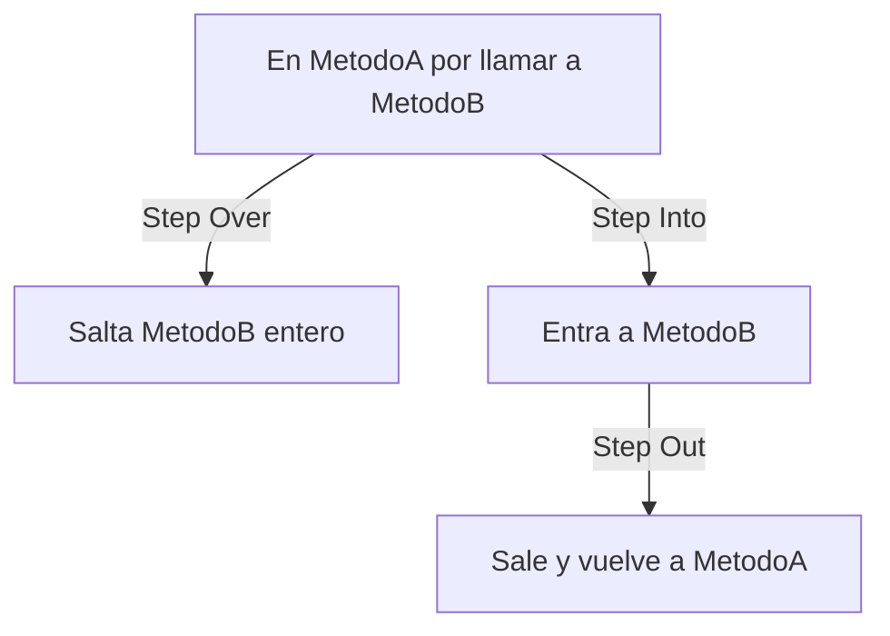

# Depuración Avanzada

Trascender el `Console.WriteLine()` / `Debug.WriteLine()` implica usar las herramientas del IDE para inspeccionar el comportamiento del sistema en tiempo real, sin modificar código.

## Breakpoints condicionales

En vez de parar la ejecución CADA vez que el código pasa por una línea (por ejemplo, dentro de un loop de 1000 elementos), el IDE se detiene solo cuando se cumple una condición específica.

### IntelliJ IDEA

1. Click en el margen izquierdo, junto al número de línea → aparece el círculo rojo.
2. Click derecho sobre el círculo → se abre un popup de configuración.
3. Campo **"Condition"** → se escribe la expresión booleana, ej: `userId == "ERR-99"`.
4. Extra: **"Log message to console"** loguea sin pausar la ejecución. **"Pass count"** hace que recién frene en la N-ésima pasada.

### Visual Studio 2022

1. Click en el margen izquierdo → círculo rojo sólido.
2. Pasa el mouse sobre el círculo → aparece un ícono de engranaje (gear). Click ahí, o click derecho → **"Conditions..."**.
3. Panel con **"Conditional Expression"** (la condición, con "Is true" o "When changed") y **"Hit Count"** (frenar en la N-ésima pasada).
4. Pista visual: un breakpoint condicional se ve como un círculo rojo con un signo "+" (o diamante, según versión) — así se distingue de uno normal a simple vista.
5. Extra: click derecho → **"Insert Tracepoint"** es el equivalente al "Log message" de IntelliJ.

### VS Code

VS Code no trae depuración para C# de fábrica — hace falta instalar la extensión **C# Dev Kit** (o la extensión C# de OmniSharp) para tener el depurador funcionando.

1. Click en el margen izquierdo, junto al número de línea → aparece el círculo rojo (breakpoint normal). Atajo de teclado: `F9` con el cursor en la línea.
2. Click derecho sobre el círculo rojo → aparece un menú con **"Edit Breakpoint..."**.
3. Se abre un widget inline con un menú desplegable donde se elige el tipo:
   - **Expression** → la condición booleana, igual que en los otros IDEs (ej: `userId == "ERR-99"`).
   - **Hit Count** → frenar recién en la N-ésima pasada.
   - **Log Message** → el equivalente a un tracepoint: loguea un mensaje en la consola de Debug sin pausar la ejecución (mismo concepto que "Log message to console" en IntelliJ o "Insert Tracepoint" en VS 2022).
4. También se puede acceder desde el panel **"Run and Debug"** (`Ctrl+Shift+D`) → sección "Breakpoints", donde se ven todos los breakpoints activos del proyecto y se pueden editar desde ahí también.

## Step Over / Step Into / Step Out

Con la ejecución pausada en un breakpoint:

| Acción | Atajo (VS) | Qué hace |
|---|---|---|
| Step Over | F10 | Ejecuta la línea actual completa y pasa a la siguiente, SIN entrar a los métodos que llama |
| Step Into | F11 | Entra DENTRO del método que se está ejecutando, para ver qué hace por dentro |
| Step Out | Shift+F11 | Termina de ejecutar el método actual y vuelve a quien lo llamó |

Regla práctica: usa Step Over por defecto (no te interesa el detalle interno de cada método que llamas), y usa Step Into solo cuando sospechas que el bug está DENTRO de ese método específico.

## Watch / Locals y Call Stack

- **Locals:** todas las variables del scope actual, con su valor en tiempo real.
- **Watch:** variables o expresiones específicas que se eligen monitorear (útil cuando "Locals" tiene demasiado ruido).
- **Call Stack:** el historial completo de métodos que se ejecutaron en secuencia hasta llegar a donde estás parado. Es una estructura **LIFO** (Last In, First Out): el último método que se llamó es el que aparece arriba de la pila, y el primero en terminar y volver cuando se resuelve. Te deja hacer click en cualquier frame anterior para ver el estado de las variables EN ESE MOMENTO de la ejecución, no solo el actual. Esta misma lógica LIFO es la razón por la que un stack trace se lee de arriba hacia abajo — ver [04-stack-traces.md](./04-stack-traces.md).

## Profiling de CPU y memoria

Sirve para responder: "¿qué método está consumiendo el 90% del procesador?" o "¿por qué la app no libera memoria (memory leak)?".

- **Visual Studio:** menú Debug → Performance Profiler (CPU Usage, Memory Usage integrados).
- **JetBrains (Rider/IntelliJ):** dotTrace (CPU), dotMemory (memoria) — herramientas separadas de JetBrains.
- **CLI multiplataforma (.NET):** `dotnet-trace` (captura de CPU) y `dotnet-counters` (métricas en vivo: GC, memoria, requests/sec) — útiles cuando no tienes IDE gráfico a mano, por ejemplo dentro de un contenedor en producción.
