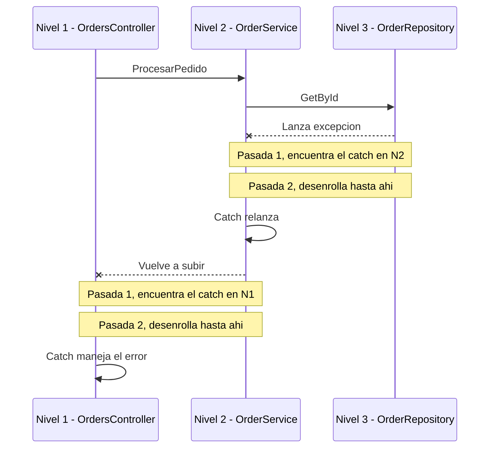

# Stack Traces

## ¿Qué es un Stack Trace?

Un stack trace es una **fotografía de la pila de llamadas en el momento exacto en que se lanzó una excepción** — lista, método por método, la cadena completa de "quién llamó a quién" para llegar hasta ahí. No es algo que se genera manualmente: el CLR la arma solo, capturando cada frame activo (cada método en ejecución) en ese instante.

## Cómo funciona con múltiples try/catch (niveles anidados)

Un caso muy común: varios métodos, en varias capas, cada uno con su propio `try/catch`, llamándose entre sí.

```csharp
// Nivel 3 (el más profundo — el repositorio)
public class OrderRepository
{
    public Order GetById(int id)
    {
        var pedido = _db.Orders.Find(id);
        if (pedido is null)
            throw new InvalidOperationException("Pedido no encontrado en la base");
        return pedido;
    }
}

// Nivel 2 (el servicio, llama al repositorio)
public class OrderService
{
    public void ProcesarPedido(int id)
    {
        try
        {
            var pedido = _repository.GetById(id);
            // ... lógica de negocio
        }
        catch (InvalidOperationException)
        {
            // Acá se podría manejar, pero se decide volver a propagar
            throw;
        }
    }
}

// Nivel 1 (el controller, llama al servicio)
public class OrdersController
{
    public IActionResult Procesar(int id)
    {
        try
        {
            _service.ProcesarPedido(id);
            return Ok();
        }
        catch (InvalidOperationException ex)
        {
            return NotFound(ex.Message); // acá sí se maneja de verdad
        }
    }
}
```

**El flujo real:** la excepción se lanza en el Nivel 3 (el más profundo). El CLR sube hacia el Nivel 2 y encuentra su `try/catch` — el tipo coincide (`InvalidOperationException`), así que entra a ese `catch`. Pero ese `catch` decide hacer `throw;` (relanzarla), así que la excepción **sigue subiendo** hacia el Nivel 1, donde recién ahí se maneja de verdad (se devuelve un `NotFound`).



Reglas clave de este proceso:

- Dentro de un mismo `try`, si hay varios `catch`, se evalúan **en el orden en que están escritos**, y gana el primero cuyo tipo coincida (o sea compatible) con la excepción lanzada. Por eso C# obliga a poner los tipos más específicos primero — si `catch (Exception)` fuera el primero, los demás nunca se alcanzarían, y el compilador lo marca como error.
- Si en un nivel **ningún catch coincide**, o el catch que coincidió hace `throw;`/relanza, la excepción sigue subiendo al llamador siguiente, y se repite el proceso ahí.
- Si llega hasta arriba de todo (el entry point) sin que nadie la maneje, es una **excepción no manejada** — se cae el proceso, o la agarra un manejador global (como `GlobalExceptionHandler.cs` en una API ASP.NET Core).

## Paso a paso lo que hace el CLR (modelo de dos pasadas)

Aplicado directamente al ejemplo de los 3 niveles de arriba:

1. `OrderRepository.GetById()` (Nivel 3) ejecuta `throw new InvalidOperationException(...)`. El CLR arranca el proceso de manejo desde ese punto exacto.

2. **Pasada 1 — búsqueda de un catch compatible (la pila todavía NO se toca):**
   - ¿`GetById()` tiene un `try/catch` alrededor de ese `throw`? No. Sigue subiendo.
   - ¿El llamador, `OrderService.ProcesarPedido()` (Nivel 2), tiene un `try/catch` que envuelva la llamada a `GetById()`? Sí, y su `catch (InvalidOperationException)` coincide en tipo. **Búsqueda terminada: el handler está en el Nivel 2.**
   - (Si ese catch tuviera un filtro `when`, se evaluaría en este mismo momento, con la pila original todavía intacta hasta el punto del throw — por eso los filtros pueden inspeccionar el estado exacto del error antes de que nada se destruya.)

3. **Pasada 2 — desenrollado:** el CLR "deshace" la pila desde `GetById()` (Nivel 3) hasta el `catch` de `ProcesarPedido()` (Nivel 2), ejecutando cualquier `finally` que hubiera entre medio (acá no hay ninguno). Recién ahora se pierde la pila original del throw.

4. **Se transfiere el control** al `catch` de `ProcesarPedido()`. Ahí se ejecuta `throw;`.

5. **Ese `throw;` dispara un proceso nuevo, desde cero, empezando en ese punto** (dentro del catch de `ProcesarPedido()`, Nivel 2): arranca otra pasada 1 de búsqueda. `ProcesarPedido()` no tiene otro `try/catch` que lo envuelva, así que sigue subiendo al llamador: `OrdersController.Procesar()` (Nivel 1), que sí tiene `catch (InvalidOperationException ex)` — coincide. Búsqueda terminada.

6. **Pasada 2 otra vez:** se desenrolla desde el catch del Nivel 2 hasta el catch del Nivel 1, y se transfiere el control ahí — donde finalmente se maneja de verdad, con `return NotFound(ex.Message)`.

**Si en ningún nivel de la cadena hubiera un catch compatible:** la búsqueda llega hasta el entry point sin encontrar nada, y es una excepción no manejada.

## ¿Se comportan igual otros lenguajes?

- **Java y Python:** prácticamente igual — búsqueda hacia arriba, catches/excepts tipados evaluados en orden, gana el primero que coincide. El modelo mental se traslada 1 a 1.
- **JavaScript:** la dirección de propagación es la misma, pero **no tiene catches tipados por lenguaje** — un `catch (e)` atrapa todo sin filtrar por tipo automáticamente; para distinguir tipos de error hay que hacerlo a mano adentro (`if (e instanceof TypeError)`). Es una diferencia de comportamiento real, no solo de sintaxis.
- **Go:** acá cambia el modelo completo, no solo el detalle — Go no tiene try/catch. Usa retornos múltiples explícitos (`valor, err := función()`) para errores esperados, y `panic`/`recover` (donde `recover()` solo funciona dentro de una función `defer`) para casos realmente excepcionales. Es un paradigma distinto, no una variación del mismo mecanismo.

## Orden de lectura correcto (específico de .NET)

Cuando imprimís una excepción completa (`ex.ToString()` o el log del framework), el formato es:

```
System.NullReferenceException: Object reference not set to an instance of an object.
   at MiApp.Servicios.PedidoService.CalcularTotal() in PedidoService.cs:line 42
   at MiApp.Controllers.PedidoController.Crear() in PedidoController.cs:line 18
   at MiApp.Program.Main() in Program.cs:line 5
```

Se lee de **arriba hacia abajo**. La línea de ARRIBA es la más profunda en la pila de llamadas — literalmente donde reventó la excepción. A medida que bajás, te vas alejando hacia quién llamó a quién, hasta el entry point.

Regla práctica: busca, empezando desde arriba, la PRIMERA línea que sea tu código (no de un framework como Entity Framework o ASP.NET Core internals). Ahí está el lugar real donde arreglar el problema.

> **Nota si algún día trabajas con Python:** ahí el orden está INVERTIDO — el header dice literalmente `Traceback (most recent call last)`, o sea la línea de ABAJO es la más profunda. Es de las pocas cosas que NO se transfieren igual entre stacks: no es sintaxis distinta, es una convención de presentación distinta.

## Tipos comunes de excepción

| Excepción | Cuándo aparece |
|---|---|
| `NullReferenceException` | Intentaste acceder a un miembro de un objeto que es `null` |
| `KeyNotFoundException` | Buscaste una clave en un `Dictionary` que no existe |
| `ArgumentNullException` | Pasaste `null` a un parámetro que explícitamente no lo acepta |
| `InvalidOperationException` | Llamaste a un método en un estado del objeto que no lo permite (ej: modificar una colección mientras la iterás) |
| `TimeoutException` | Una operación (típicamente de base de datos o red) tardó más del límite configurado |

## throw; vs throw ex;

```csharp
try
{
    ProcesarPedido();
}
catch (Exception ex)
{
    // MAL: reinicia el stack trace, perdés la línea real donde ocurrió el error
    throw ex;

    // BIEN: preserva el stack trace original completo
    throw;

    // BIEN (alternativa): envolvés el error original como Inner Exception
    throw new PedidoException("No se pudo procesar el pedido", ex);
}
```

¿Por qué pasa esto? En .NET, el CLR captura el stack trace en el momento del `throw`, no en el momento en que se creó el objeto `Exception`. Si volvés a lanzar la MISMA excepción con `throw ex;`, el CLR lo trata como un throw nuevo y le pisa el stack trace original — perdés la información de dónde ocurrió realmente el error, y el trace ahora apunta al `catch` en vez de al lugar real del fallo.

`throw;` (sin especificar la excepción) le dice al CLR "relanzá esta excepción tal cual, sin tocar el trace" — por eso preserva el original.

Esta particularidad es del CLR de .NET específicamente. Java y JavaScript capturan el stack trace en el momento de CREAR la excepción (`new Exception()` / `new Error()`), no en el throw, así que no tienen este mismo problema.
