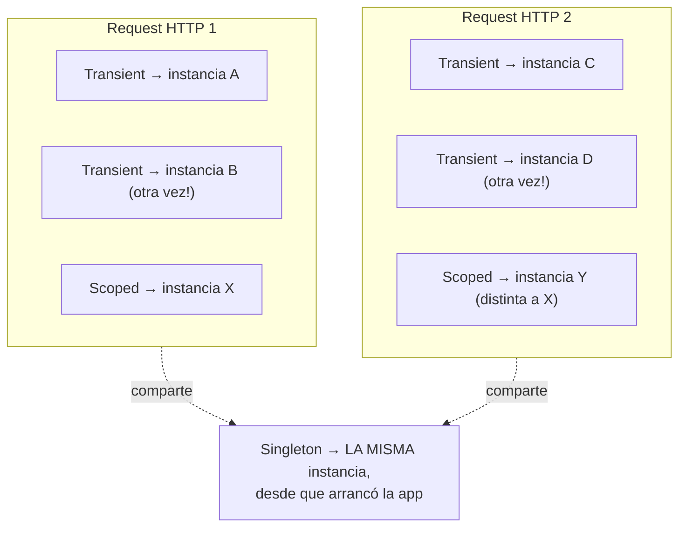
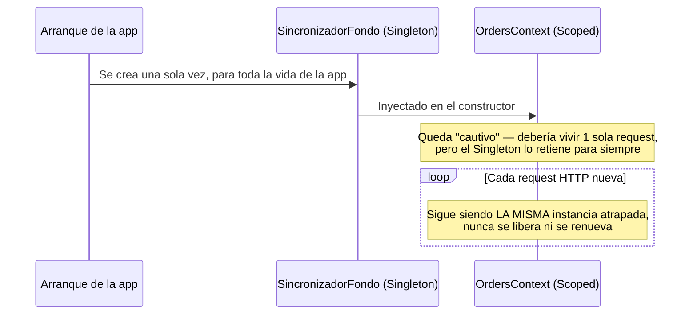

# Inyección de Dependencias: Lifetimes y Patrón Options

## Los 3 lifetimes de DI

Cuando se registra un servicio en el contenedor de DI de .NET (`builder.Services.Add...`), hay que decidir **cuánto tiempo vive** cada instancia. No existe un valor por defecto — **siempre hay que especificarlo explícitamente**, con `AddTransient`, `AddScoped` o `AddSingleton`. Si un servicio no se registra, no "cae" en ningún lifetime por defecto — directamente falla en tiempo de ejecución con un error de resolución.

### Transient

Se crea una instancia **nueva cada vez** que algo la pide — no se comparte nada, ni siquiera dentro de la misma request.

```csharp
builder.Services.AddTransient<IEmailSender, EmailSender>();
```

### Scoped

Se crea **una sola instancia por request HTTP**, y se comparte entre todo lo que se resuelva dentro de esa misma request. Al terminar la request, se destruye.

```csharp
builder.Services.AddScoped<IOrderRepository, OrderRepository>();
```

El ejemplo más importante de Scoped en cualquier API con EF Core: **el `DbContext`**. El propio proyecto ya lo usa así — `AddDbContext<OrdersContext>(...)` se registra como Scoped por defecto, precisamente porque hace falta la MISMA instancia de contexto durante toda la request (para que el tracking de cambios de EF Core funcione bien), pero no conviene compartirla entre requests distintas de usuarios distintos.

**Nota técnica real, no obvia:** en una aplicación de consola simple (sin ASP.NET Core), si se resuelve un servicio Scoped directo del `ServiceProvider` raíz — sin crear un `scope` explícito con `CreateScope()` — ese servicio se comporta exactamente como un Singleton. Esto pasa porque el propio proveedor raíz actúa como un scope implícito para toda su vida. No es que la inyección "no funcione" en consola — es el comportamiento esperado. Recién se ve la diferencia real cuando se crean scopes explícitos, o en ASP.NET Core, que crea uno automáticamente por cada request HTTP.

### Singleton

Se crea **una sola vez en toda la vida de la aplicación**, y todos comparten la misma instancia — desde el primer request hasta que la app se apaga.

```csharp
builder.Services.AddSingleton<ICacheService, CacheService>();
```



Transient nunca reutiliza, ni dentro de la misma request. Scoped reutiliza dentro de una request, pero es una instancia distinta en cada request nueva. Singleton es la única instancia que cruza todas las requests, todo el tiempo de vida de la app.

**Advertencia importante:** un Singleton nunca debería tener estado mutable compartido sin control. Si un Singleton tiene un campo que cambia (`public int Contador;`), y un usuario lo modifica, **todos los demás usuarios ven ese cambio** — porque literalmente es el mismo objeto en memoria para toda la aplicación. Es una fuente clásica de bugs difíciles de rastrear en producción, sobre todo bajo carga concurrente.

## La Dependencia Cautiva (Captive Dependency)

Un error real y común: inyectar un servicio **Scoped** (como el `DbContext`) directo en el constructor de un **Singleton**.

```csharp
// Peligroso: un Singleton que vive para siempre, atrapando un DbContext Scoped
public class SincronizadorFondo
{
    private readonly OrdersContext _db; // mal: DbContext Scoped inyectado en un Singleton

    public SincronizadorFondo(OrdersContext db) => _db = db;
}
```



El `DbContext` queda "cautivo" — como el Singleton nunca muere, esa instancia del contexto tampoco. La conexión a la base de datos nunca se cierra correctamente, y con el tiempo el servidor se queda sin memoria o sin conexiones disponibles.

**La solución real: inyectar `IServiceScopeFactory`, no el servicio Scoped directamente.**

```csharp
public class SincronizadorFondo
{
    private readonly IServiceScopeFactory _scopeFactory;

    public SincronizadorFondo(IServiceScopeFactory scopeFactory) => _scopeFactory = scopeFactory;

    public void EjecutarTareaNocturna()
    {
        // Se crea un scope temporal, se usa, y se destruye — cada vez que hace falta
        using var scope = _scopeFactory.CreateScope();
        var db = scope.ServiceProvider.GetRequiredService<OrdersContext>();

        db.Orders.Add(/* ... */);
        db.SaveChanges();
        // Al salir del using, el scope (y el DbContext que contiene) se libera correctamente
    }
}
```

Con esto, el Singleton puede vivir para siempre sin problema — cada vez que necesita algo Scoped, abre y cierra su propio ciclo de vida temporal, en vez de quedarse con una instancia atrapada.

## Patrón Options: configuración tipada

Ya se trabajó con `appsettings.json` en punto 1 (ver [03-interpretacion-de-logs.md](../01-autonomia-resolucion-problemas/03-interpretacion-de-logs.md)). El Patrón Options resuelve un problema puntual: leer esa configuración como strings sueltos (`builder.Configuration["Serilog:MinimumLevel:Default"]`) es propenso a errores de tipeo, no tiene autocompletado, y es difícil de mantener.

La solución es convertir esa sección del JSON en una clase C# tipada:

```json
"ApiSettings": {
  "Url": "https://api.com",
  "Timeout": 30
}
```

```csharp
public class ApiSettings
{
    public string Url { get; set; } = string.Empty;
    public int Timeout { get; set; }
}
```

.NET hace el binding automático del JSON a la clase, con autocompletado e IntelliSense en vez de strings sueltos.

**Las 3 variantes, según cuándo hace falta que se actualice el valor:**

| Interfaz | Lifetime | ¿Cuándo se lee el valor? |
|---|---|---|
| `IOptions<T>` | Singleton | Una sola vez, al arrancar la app. No refleja cambios posteriores al archivo de configuración. |
| `IOptionsSnapshot<T>` | Scoped | Se recalcula una vez por request — sí refleja cambios del archivo entre requests. |
| `IOptionsMonitor<T>` | Singleton | Se puede consultar en cualquier momento y detecta cambios en tiempo real, con un evento `OnChange` para reaccionar cuando el archivo de configuración cambia mientras la app sigue corriendo. |

Para la mayoría de los casos (configuración que no cambia en caliente, como la URL de un servicio externo), `IOptions<T>` alcanza. `IOptionsMonitor<T>` se reserva para casos donde realmente hace falta reaccionar a un cambio de configuración sin reiniciar la aplicación.

**A qué lifetime del consumidor corresponde cada uno** (esto conecta directo con la Dependencia Cautiva de arriba): `IOptionsSnapshot<T>` es Scoped — por eso solo tiene sentido inyectarlo en servicios Scoped o Transient (como un controller), nunca en un Singleton, por la misma razón que no se inyecta un `DbContext` Scoped en un Singleton. `IOptionsMonitor<T>` es Singleton, y es justamente la herramienta pensada para servicios de larga vida que necesitan enterarse de cambios de configuración sin poder depender de algo Scoped:

```csharp
public class SincronizadorApiSingleton
{
    private IntegracionConfig _configuracionActual;

    public SincronizadorApiSingleton(IOptionsMonitor<IntegracionConfig> monitor)
    {
        _configuracionActual = monitor.CurrentValue; // valor inicial al arrancar

        // Se suscribe al evento de cambio del archivo — se dispara solo, sin reiniciar el servidor
        monitor.OnChange(nuevaConfig => _configuracionActual = nuevaConfig);
    }
}
```

## Validar la configuración al arranque, no en producción

El Patrón Options por sí solo evita errores de tipeo en las LLAVES del JSON, pero no evita que alguien deje una URL vacía o ponga un timeout negativo — esos valores se mapean igual, y el problema explota más adelante, en producción. Se puede blindar esto con Data Annotations, aplicando el mismo espíritu de las Guard Clauses (ver [02-arquitectura-y-limites.md](./02-arquitectura-y-limites.md)): fallar rápido y explícito, no silenciosamente después.

```csharp
public class IntegracionConfig
{
    [Required(ErrorMessage = "La URL del Webhook es obligatoria.")]
    [Url(ErrorMessage = "El formato de la URL es inválido.")]
    public string ServicioWebhookUrl { get; set; } = string.Empty;

    [Required]
    public string ApiKey { get; set; } = string.Empty;

    [Range(1, 60, ErrorMessage = "El Timeout debe estar entre 1 y 60 segundos.")]
    public int TimeoutSegundos { get; set; }
}
```

```csharp
builder.Services.AddOptions<IntegracionConfig>()
    .Bind(builder.Configuration.GetSection("IntegracionExterna"))
    .ValidateDataAnnotations()
    .ValidateOnStart(); // fuerza la validación al arrancar la app, no la primera vez que se use
```

Con `.ValidateOnStart()`, si el JSON tiene un timeout de `-2` o le falta la URL, la aplicación **se niega a arrancar** y tira la excepción de validación en el primer milisegundo — en vez de encender con datos corruptos y fallar recién cuando un usuario real dispare esa parte del código.

## Inyectar múltiples implementaciones con `IEnumerable<T>`

Cuando varias clases distintas implementan la misma interfaz, se pueden inyectar TODAS juntas con `IEnumerable<T>` — el contenedor entrega la colección completa de lo que esté registrado contra esa interfaz.

```csharp
public interface INotificadorFactura
{
    void Notificar(string cliente, decimal monto);
}

public class NotificadorEmail : INotificadorFactura
{
    public void Notificar(string cliente, decimal monto) => Console.WriteLine($"Email a {cliente}");
}

public class NotificadorWhatsApp : INotificadorFactura
{
    public void Notificar(string cliente, decimal monto) => Console.WriteLine($"WhatsApp a {cliente}");
}

public class EmisorFacturas
{
    private readonly IEnumerable<INotificadorFactura> _notificadores;

    public EmisorFacturas(IEnumerable<INotificadorFactura> notificadores) => _notificadores = notificadores;

    public void ProcesarVenta(string cliente, decimal monto)
    {
        foreach (var notificador in _notificadores)
            notificador.Notificar(cliente, monto);
    }
}
```

```csharp
builder.Services.AddTransient<INotificadorFactura, NotificadorEmail>();
builder.Services.AddTransient<INotificadorFactura, NotificadorWhatsApp>();
```

`EmisorFacturas` no sabe ni le importa cuántos canales de notificación existen. Si mañana se agrega `NotificadorTelegram`, se crea la clase, se registra una línea más, y `EmisorFacturas` nunca se toca — es Open/Closed Principle (ver [01-solid-y-patrones.md](./01-solid-y-patrones.md)) aplicado directamente a la inyección de dependencias.

## DI en otros lenguajes (TS, Python, Java) — el mecanismo cambia, no solo la sintaxis

El concepto (recibir dependencias desde afuera en vez de crearlas adentro) es universal. Lo que cambia bastante es si existe un contenedor formal, y cuál es el comportamiento por defecto:

- **Java (Spring):** tiene su propio contenedor de DI (el *ApplicationContext*), con un detalle que contradice directamente la regla de .NET: **el scope por defecto en Spring ES Singleton.** Si no se especifica nada, Spring asume Singleton — lo opuesto a .NET, donde no existe ningún lifetime por defecto y siempre hay que declararlo explícitamente.
- **TypeScript (NestJS):** el framework NestJS fue diseñado deliberadamente parecido al modelo de .NET/Angular — tiene un contenedor de DI real, con `@Injectable()` y scopes (`DEFAULT`, `REQUEST`, `TRANSIENT`). Igual que Spring, `DEFAULT` en NestJS se comporta como Singleton si no se especifica otra cosa — de los tres, es el que más se parece a .NET en estructura, pero comparte con Java el detalle del scope por defecto.
- **Python:** no hay un contenedor de DI integrado y universal como en .NET. Depende completamente del framework: FastAPI tiene su propio sistema basado en funciones (`Depends()`), resuelto por parámetro en cada endpoint, sin conceptos formales de Transient/Scoped/Singleton — esos comportamientos hay que armarlos a mano si hacen falta. Django ni siquiera tiene DI formal en el núcleo; las dependencias se importan o se pasan manualmente, o se usa una librería de terceros aparte.

La lección de fondo, otra vez: antes de aplicar la regla de "no hay lifetime por defecto" (válida en .NET) a un proyecto en Spring o NestJS, hay que verificar el comportamiento real de ese framework — ahí el default SÍ existe, y es Singleton.
