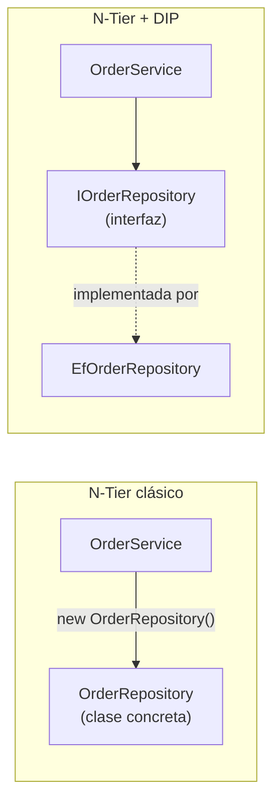

# Arquitectura en Capas (N-Tier) en la Práctica

## El concepto ya lo viste — esto es cómo se ve escrito en código real

La idea de separar Presentación, Lógica de Negocio (BLL) y Acceso a Datos (DAL) ya está en [Arquitectura y Límites entre Capas](./02-arquitectura-y-limites.md) y, a nivel de sistema completo, en el [punto 11](../11-arquitectura-de-sistemas-y-estilos-arquitectonicos/02-cliente-servidor-y-arquitectura-en-capas.md). Este archivo se enfoca en algo distinto: técnicas concretas que aparecen al implementar N-Tier en C# real, y un matiz importante que el material típico de curso suele pasar por alto.

## El matiz: "conocer una capa" no es todo o nada

Es común leer una regla como: *"la Capa de Negocio no sabe si los datos se guardan en SQL Server, Oracle o un archivo de texto — no conoce el Acceso a Datos"*, y unas líneas después: *"la Lógica de Negocio conoce y llama al Acceso a Datos"*. Estas dos frases, tal como suelen presentarse juntas, se contradicen — y vale la pena desarmar por qué, porque ahí está el matiz real:

- **N-Tier "clásico" (sin interfaces):** la BLL sí conoce el **tipo concreto** de la clase de la DAL (`new OrderRepository()` dentro de `OrderService`) — eso es literalmente "conocerla". Lo que NO conoce son los **detalles internos** de esa clase (la cadena de conexión, el motor de base de datos, el SQL exacto).
- **N-Tier + Inversión de Dependencias:** la BLL ya no conoce ni siquiera el tipo concreto — solo conoce una interfaz (`IOrderRepository`), y la implementación real se decide desde afuera.



La diferencia práctica: en el primer caso, para testear `OrderService` de forma aislada (sin base de datos real) no hay forma — el objeto concreto siempre se crea adentro. En el segundo, un test puede inyectar una implementación falsa de `IOrderRepository` (ver [03-estrategia-de-testing.md](./03-estrategia-de-testing.md) y [06-inyeccion-de-dependencias.md](./06-inyeccion-de-dependencias.md)). N-Tier por sí solo solo te da **organización y una dirección de dependencia clara** (de arriba hacia abajo) — no te da automáticamente testabilidad ni intercambiabilidad. Eso lo agrega específicamente el Principio de Inversión de Dependencias, no la arquitectura en capas en sí misma.

## Patrón DTO: la entidad interna no es lo que se expone afuera

Un error común es que la Capa de Presentación reciba directamente la entidad de dominio completa, con campos que no debería ver o que no le sirven de nada (datos internos, columnas de auditoría, relaciones completas de EF Core). El patrón **DTO (Data Transfer Object)** resuelve esto: la BLL mapea la entidad interna a un objeto más chico, pensado específicamente para lo que la pantalla necesita mostrar.

```csharp
// Entidad interna — puede tener campos que no le importan a la UI
public class Order
{
    public int Id { get; set; }
    public string CustomerName { get; set; } = string.Empty;
    public decimal Total { get; set; }
    public decimal CostoInterno { get; set; } // dato interno, nunca debería salir de la BLL
}

// DTO — lo único que la Presentación necesita ver
public record OrderSummaryDto(string CustomerName, string TotalFormateado);

public class OrderService
{
    private readonly IOrderRepository _repository;

    public OrderService(IOrderRepository repository) => _repository = repository;

    public async Task<List<OrderSummaryDto>> ObtenerResumenAsync()
    {
        var pedidos = await _repository.GetAllAsync();

        // El mapeo ocurre en la BLL, no en la Presentación
        return pedidos
            .Select(p => new OrderSummaryDto(p.CustomerName, $"S/ {p.Total:F2}"))
            .ToList();
    }
}
```

Esto no es una idea aislada de N-Tier — es exactamente lo que ya hace un Controller REST al devolver un DTO en vez de la entidad de EF Core completa (visto en el [punto 3](../03-diseno-de-apis-y-contratos/)). El nombre cambia según el contexto, la idea de fondo es la misma: nunca exponer la forma interna de los datos tal cual, sobre todo cuando esa forma interna incluye datos sensibles o irrelevantes para quien consume.

## Excepciones de negocio personalizadas — con una advertencia real

En vez de que un método de la BLL devuelva un `string` con el error ("Error: el precio debe ser mayor a cero"), se puede definir una excepción propia y lanzarla:

```csharp
public class ReglaNegocioException : Exception
{
    public ReglaNegocioException(string mensaje) : base(mensaje) { }
}

public class OrderService
{
    public void ValidarPedido(Order pedido)
    {
        if (pedido.Total <= 0)
            throw new ReglaNegocioException("El total del pedido debe ser mayor a cero.");
    }
}
```

La ventaja real frente a devolver un string: quien llama **no puede ignorar el error silenciosamente** (un string de error se puede simplemente no revisar; una excepción no manejada interrumpe la ejecución), y se puede capturar selectivamente por tipo (`catch (ReglaNegocioException ex)`) sin atrapar cualquier otro error inesperado del sistema. Esto conecta directamente con lo que ya viste sobre el mecanismo de excepciones en el [punto 1](../01-autonomia-resolucion-problemas/04-stack-traces.md), y con **RFC 7807 Problem Details** del punto 3 — un middleware que traduce `ReglaNegocioException` a una respuesta 400 con formato estándar es la versión "de API" de exactamente este mismo patrón.

**La advertencia:** usar excepciones para *cada* validación de negocio (incluidas las que pasan todo el tiempo, como un formulario con un campo vacío) es una decisión de diseño con un trade-off real, no una verdad absoluta. Las excepciones tienen costo de rendimiento (construir el stack trace, desenrollar la pila) y, más importante, mezclan dos categorías distintas de "error": algo **esperado y común** (un usuario que escribió mal un dato) y algo **verdaderamente excepcional** (la base de datos no responde). Una alternativa real, cada vez más usada en C# moderno, es el **patrón Result** (`Result<T>` con éxito/lista de errores, sin lanzar nada) para validaciones de negocio esperables, reservando `throw` de verdad para fallos inesperados del sistema. Ninguna de las dos es "la correcta" de forma universal — es otro trade-off (ver [05-que-son-los-tradeoffs.md](../01-autonomia-resolucion-problemas/05-que-son-los-tradeoffs.md)), y ambas son válidas según qué tan "normal" sea el caso de error en tu dominio.

## Repositorio Genérico — cuidado con la sobre-abstracción

Para evitar repetir `Insertar`/`ObtenerTodos` en un repositorio por cada entidad (`Order`, `Customer`, `Product`), se puede definir un contrato genérico:

```csharp
public interface IRepository<T> where T : class
{
    Task<T?> GetByIdAsync(int id);
    Task AddAsync(T entidad);
}

public class EfRepository<T> : IRepository<T> where T : class
{
    private readonly AppDbContext _context;

    public EfRepository(AppDbContext context) => _context = context;

    public Task<T?> GetByIdAsync(int id) => _context.Set<T>().FindAsync(id).AsTask();

    public Task AddAsync(T entidad)
    {
        _context.Set<T>().Add(entidad);
        return _context.SaveChangesAsync();
    }
}
```

Esto es DRY (ver [07-principios-de-simplicidad.md](./07-principios-de-simplicidad.md)) aplicado a acceso a datos, y funciona bien para operaciones CRUD simples. **Pero hay una crítica real y conocida en la comunidad .NET que vale la pena conocer antes de aplicarlo por todos lados:** un Repositorio Genérico sobre EF Core termina siendo, en la práctica, una versión *más pobre* del propio `DbContext` — EF Core ya sabe hacer `Include()` para cargas relacionadas, proyecciones LINQ complejas, y transacciones que tocan varias entidades a la vez. Un `IRepository<T>` genérico normalmente no puede exponer todo eso sin volverse tan complejo como el propio EF Core, o sin terminar filtrando `IQueryable<T>` hacia afuera de la interfaz (lo cual rompe el propósito original de esconder EF Core). Es el mismo matiz que ya se documentó en [SOLID y Patrones](./01-solid-y-patrones.md#repository) sobre envolver un `DbContext` en otro Repository — el genérico es esa misma discusión, multiplicada a nivel de todo el sistema en vez de una sola entidad.

**Cuándo sí conviene:** entidades realmente simples, sin consultas complejas propias, o cuando la fuente de datos no es EF Core (una API externa, un archivo) donde sí existe una necesidad real de compartir código entre varias entidades.

## Async de punta a punta: por qué no alcanza con solo el Controller

Si el Controller es `async` pero en algún punto intermedio de la cadena alguien llama `.Result` o `.Wait()` sobre una `Task` en vez de usar `await`, el hilo queda bloqueado esperando de forma síncrona — se pierde la ventaja de la asincronía, y en cargas altas esto puede agotar el thread pool del servidor, afectando a *todas* las requests, no solo a esa.

La regla práctica: si la DAL expone un método `async Task`, la BLL que lo llama también debe ser `async Task` y usar `await`, y así hasta llegar al Controller. Cortar la cadena de `async`/`await` en un punto intermedio (con `.Result`, `.Wait()`, o un método síncrono que envuelve uno asíncrono) es un anti-patrón real, no un detalle de estilo — puede generar deadlocks en algunos contextos (especialmente en aplicaciones de escritorio con `SynchronizationContext`) además del problema de escalabilidad ya mencionado.
