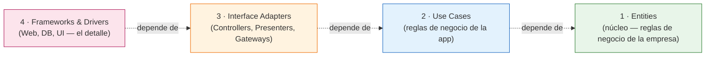

# Clean Architecture

## Origen

Clean Architecture la formalizó **Robert C. Martin ("Uncle Bob")** en un post de 2012 y después en su libro de 2017 *"Clean Architecture: A Craftsman's Guide to Software Structure and Design"*. No es una idea completamente nueva — es una síntesis de propuestas que ya circulaban con el mismo objetivo de fondo: **Hexagonal Architecture** (Alistair Cockburn, 2005), **Onion Architecture** (Jeffrey Palermo, 2008), y otras. Todas resuelven el mismo problema con vocabulario distinto, algo que conviene tener claro para no memorizar 3 nombres como si fueran 3 ideas distintas.

## La Regla de Dependencia (lo único realmente importante)

Clean Architecture se dibuja como círculos concéntricos, pero el dibujo es secundario. Lo que importa es una sola regla:

> El código fuente solo puede depender **hacia adentro**. Una capa interna no puede saber nada — ni un `using`/`import` — de una capa externa.

Esto es Dependency Inversion Principle (el "D" de SOLID, punto 2) aplicado a nivel de arquitectura completa, no solo entre dos clases.

## Las 4 capas



Aunque el dibujo clásico de Clean Architecture es de círculos concéntricos, lo que importa es la dirección de la flecha: **1 (Entities)** nunca sabe que existen las capas 2, 3 o 4 — es la capa más externa la que depende de las internas, nunca al revés.

1. **Entities:** las reglas de negocio más generales de la empresa — objetos de dominio puros, sin saber que existe una base de datos, una API o una UI. Es el círculo más interno.
2. **Use Cases:** reglas de negocio específicas de la aplicación — orquestan Entities para cumplir un caso de uso concreto (ej. "Crear un pedido", "Cancelar una reserva"). Conocen a las Entities, pero no conocen frameworks.
3. **Interface Adapters:** traducen datos entre el formato que le conviene a Use Cases/Entities y el formato que le conviene al mundo exterior — Controllers, Presenters, y las implementaciones de los Gateways/Repositorios (la clase concreta, no la interfaz).
4. **Frameworks & Drivers:** la capa más externa — el framework web, la base de datos concreta, la UI, dispositivos externos. Es el "detalle" reemplazable; el negocio no debería temblar si mañana cambias de SQL Server a PostgreSQL, o de ASP.NET a otro framework.

## Modelo de Dominio Rico vs. Anémico

Un error frecuente al implementar la capa de Entities: crear clases que son solo "bolsas de propiedades" con `get; set;` públicos en todo, y mover TODA la validación y lógica hacia afuera (a un Use Case o un Service). Esto se conoce como **Modelo de Dominio Anémico** — un término acuñado por Martin Fowler (2003) precisamente para señalarlo como un antipatrón, no como una alternativa neutral.

```csharp
// Modelo Anémico: la entidad no protege nada, cualquiera puede dejarla en un estado inválido
public class Order
{
    public Guid Id { get; set; }
    public decimal Total { get; set; } // nada impide asignar un total negativo
}

// La validación queda "suelta" en el Use Case, y es fácil que otro Use Case la olvide
public class CreateOrderUseCase
{
    public void Execute(Order order)
    {
        if (order.Total <= 0) throw new ArgumentException("Total inválido"); // se puede omitir por error
        // ...
    }
}
```

Un **Modelo de Dominio Rico** hace lo contrario: la propia entidad se protege a sí misma, con propiedades de solo lectura externa (`private set`) y un constructor o métodos que son los únicos capaces de cambiar su estado — es matemáticamente imposible que exista una instancia de `Order` en un estado inválido, sin importar desde qué Use Case se cree.

```csharp
// Modelo Rico: la entidad se autoprotege, sin importar quién la use
public class Order
{
    public Guid Id { get; private set; }
    public decimal Total { get; private set; }

    public Order(decimal total)
    {
        if (total <= 0)
            throw new ArgumentException("El total del pedido debe ser mayor a cero.");

        Id = Guid.NewGuid();
        Total = total;
    }

    // Cambiar el estado solo es posible a través de un comportamiento explícito, nunca por asignación directa
    public void AplicarDescuento(decimal porcentaje)
    {
        if (porcentaje is <= 0 or >= 1) return;
        Total -= Total * porcentaje;
    }
}
```

Con este diseño, `CreateOrderUseCase` ya no necesita repetir la validación — simplemente no puede construir un `Order` inválido, porque el propio constructor lo impide. Esto es lo que ya se insinuaba en el ejemplo anterior con `order.ValidateBusinessRules()`: en un modelo verdaderamente rico, ese método ni siquiera haría falta, porque la validación ya ocurrió al construir el objeto.

## Cómo se ve en un proyecto .NET real

La forma más común de mapear esto a una solución de Visual Studio es con un proyecto por capa:

```
MiApp.Domain          → Entities (sin referencias a nada externo)
MiApp.Application     → Use Cases + interfaces (IOrderRepository, IEmailSender)
MiApp.Infrastructure  → Implementaciones concretas (EF Core, SMTP, APIs externas)
MiApp.Api             → Controllers, Program.cs (composition root)
```

La clave está en la dirección de las referencias de proyecto: `Infrastructure` referencia a `Application` (para implementar sus interfaces), pero `Application` **nunca** referencia a `Infrastructure`. Si alguna vez ves un `using MiApp.Infrastructure` dentro de `MiApp.Application`, la Regla de Dependencia ya se rompió.

```csharp
// MiApp.Application — la interfaz vive en la capa interna
public interface IOrderRepository
{
    Task<Order?> GetByIdAsync(Guid id);
    Task SaveAsync(Order order);
}

public class CreateOrderUseCase
{
    private readonly IOrderRepository _repository;

    // Depende de la abstracción, nunca del EF Core concreto
    public CreateOrderUseCase(IOrderRepository repository)
    {
        _repository = repository;
    }

    public async Task ExecuteAsync(Order order)
    {
        order.ValidateBusinessRules();
        await _repository.SaveAsync(order);
    }
}
```

```csharp
// MiApp.Infrastructure — el detalle, reemplazable
public class EfOrderRepository : IOrderRepository
{
    private readonly AppDbContext _context;

    public EfOrderRepository(AppDbContext context) => _context = context;

    public Task<Order?> GetByIdAsync(Guid id) =>
        _context.Orders.FindAsync(id).AsTask();

    public Task SaveAsync(Order order)
    {
        _context.Orders.Add(order);
        return _context.SaveChangesAsync();
    }
}
```

La conexión entre la interfaz y su implementación concreta se arma en el **composition root** (`Program.cs`), con inyección de dependencias — el mismo mecanismo que ya viste en el archivo de [Inyección de Dependencias](./06-inyeccion-de-dependencias.md):

```csharp
builder.Services.AddScoped<IOrderRepository, EfOrderRepository>();
builder.Services.AddScoped<CreateOrderUseCase>();
```

## La prueba real del desacople: un Fake en vez de una base de datos

La forma más concreta de comprobar que la Regla de Dependencia realmente se cumple es esta: ¿se puede probar `CreateOrderUseCase` sin levantar SQL Server? Si la respuesta es sí, la arquitectura está haciendo su trabajo.

```csharp
// Un Fake: cumple la interfaz, pero no toca ninguna base de datos real
public class FakeOrderRepository : IOrderRepository
{
    public Task<Order?> GetByIdAsync(Guid id) => Task.FromResult<Order?>(null);
    public Task SaveAsync(Order order) => Task.CompletedTask; // no hace nada, solo "acepta"
}

[Fact]
public async Task ExecuteAsync_ConTotalInvalido_LanzaExcepcion()
{
    var useCase = new CreateOrderUseCase(new FakeOrderRepository());

    // El dominio rechaza el total inválido antes de que el Fake reciba nada
    await Assert.ThrowsAsync<ArgumentException>(() => useCase.ExecuteAsync(new Order(-100m)));
}
```

Esto corre en milisegundos, sin red, sin disco, sin depender de que exista una base de datos configurada en la máquina que ejecuta el test — exactamente el mismo argumento de mocking de límites externos que ya viste en [03-estrategia-de-testing.md](./03-estrategia-de-testing.md).

**Nota al margen sobre C# (un error real y común):** si en algún momento divides una clase en varios archivos con `partial` (por ejemplo, para separar los métodos de escritura de los de lectura), **todas** las declaraciones de esa clase en todos los archivos deben llevar la palabra `partial` — incluida la primera. Si el archivo original la declaró como `public class OrquestadorNodos` (sin `partial`) y un archivo nuevo la retoma como `public partial class OrquestadorNodos`, el compilador rechaza el código con el error CS0260 ("falta el modificador partial"). No es un detalle menor de sintaxis — es un error de compilación real que aparece seguido en material de estudio que muestra clases "actualizadas" en fragmentos separados sin aclarar este requisito.

## El punto real de todo esto

No es "tener 4 proyectos" — puedes violar la Regla de Dependencia con 4 proyectos igual de fácil que con uno. El punto es que las reglas de negocio (`CreateOrderUseCase`, `Order`) se puedan probar con un unit test sin levantar una base de datos real, y que un cambio de infraestructura (cambiar de EF Core a Dapper, de SQL Server a PostgreSQL) no obligue a tocar una sola línea de `Application` ni de `Domain`.
