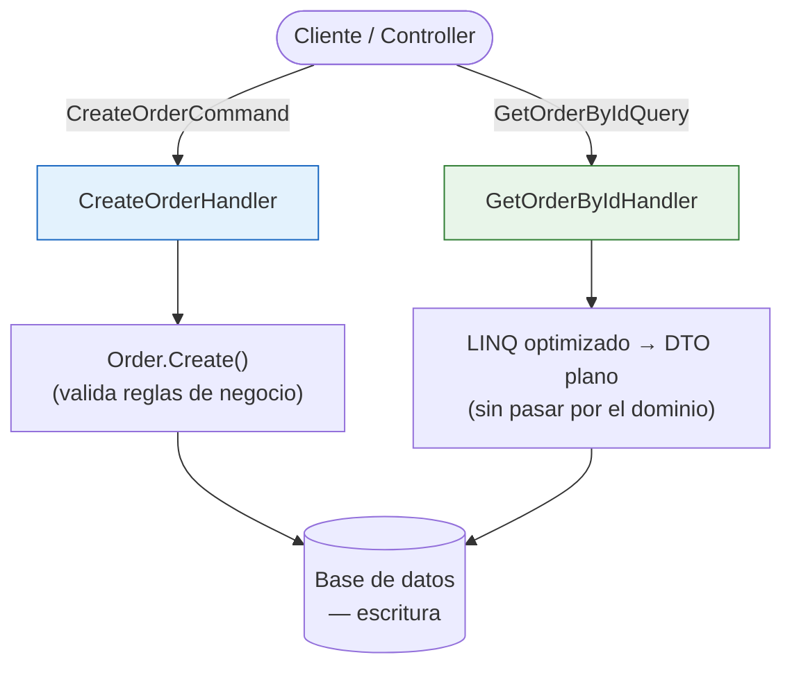

# CQRS (Command Query Responsibility Segregation)

## Origen y qué problema resuelve

CQRS lo formalizó **Greg Young** alrededor de 2010, basándose en un principio más viejo: **CQS** (Command-Query Separation) de Bertrand Meyer (1988), que dice que un método debería **o** cambiar estado (comando) **o** devolver datos (consulta), nunca ambas cosas a la vez a nivel de método individual.

CQRS lleva esa misma idea, pero a nivel de **arquitectura completa**: separar el modelo que maneja escrituras (Commands) del modelo que maneja lecturas (Queries), en vez de usar un único modelo de "servicio" que hace todo (el típico `OrderService` con `GetOrder`, `CreateOrder`, `UpdateOrder`, `DeleteOrder` todo junto).

## Corrigiendo un malentendido muy común

Es habitual escuchar que "CQRS significa tener dos bases de datos, una para escribir y otra para leer". **Eso es falso como requisito** — es una variante avanzada opcional (a veces combinada con Event Sourcing), no la definición de CQRS. En su forma más simple y mucho más común en la práctica, CQRS es solo separar las **clases/handlers** de comandos y consultas contra la **misma base de datos**. Confundir esto lleva a pensar que CQRS es más complejo (y más caro de implementar) de lo que realmente es en su versión básica.

## Cómo se ve en .NET (con MediatR)

La librería **MediatR** (Jimmy Bogard) es la forma más común de implementar CQRS en proyectos .NET — no es CQRS en sí misma, es una herramienta de mensajería in-process que encaja muy bien con el patrón.

```csharp
// Command: cambia estado, no devuelve datos de negocio (como mucho, un Id o un resultado de éxito/fallo)
public record CreateOrderCommand(Guid CustomerId, List<OrderItem> Items) : IRequest<Guid>;

public class CreateOrderHandler : IRequestHandler<CreateOrderCommand, Guid>
{
    private readonly IOrderRepository _repository;

    public CreateOrderHandler(IOrderRepository repository) => _repository = repository;

    public async Task<Guid> Handle(CreateOrderCommand request, CancellationToken ct)
    {
        var order = Order.Create(request.CustomerId, request.Items); // reglas de negocio aquí
        await _repository.SaveAsync(order);
        return order.Id;
    }
}
```

```csharp
// Query: solo lee, nunca modifica estado
public record GetOrderByIdQuery(Guid OrderId) : IRequest<OrderDto>;

public class GetOrderByIdHandler : IRequestHandler<GetOrderByIdQuery, OrderDto>
{
    private readonly AppDbContext _context;

    public GetOrderByIdHandler(AppDbContext context) => _context = context;

    public Task<OrderDto> Handle(GetOrderByIdQuery request, CancellationToken ct) =>
        _context.Orders
            .Where(o => o.Id == request.OrderId)
            .Select(o => new OrderDto(o.Id, o.CustomerName, o.Total))
            .FirstAsync(ct);
}
```

Un detalle real de por qué esto es útil más allá de "separar por separar": el `Command` pasa por `Order.Create()`, que valida las reglas de negocio del dominio. El `Query` va directo con LINQ optimizado a un DTO plano — no tiene sentido cargar toda la entidad `Order` con su lógica de negocio solo para mostrar 3 campos en una pantalla. Las lecturas se pueden optimizar libremente (incluso con SQL crudo vía Dapper si hace falta rendimiento) sin arriesgar las reglas de negocio, porque las escrituras siguen pasando por el modelo de dominio real.



Los dos caminos son intencionalmente distintos: el de escritura (azul) siempre cruza el dominio y sus validaciones; el de lectura (verde) va directo a un DTO, sin ninguna razón para pasar por reglas de negocio que no aplican al simple hecho de mostrar datos.

## Cuándo usarlo (y cuándo NO)

CQRS agrega una capa de indirección real: más clases, más archivos, más que navegar para entender un flujo. Esto conecta directamente con **YAGNI** y la Regla de Tres de Sandi Metz ya vistas en [Principios de Simplicidad](./07-principios-de-simplicidad.md): para un CRUD simple sin lógica de negocio compleja, CQRS es sobre-ingeniería — un `OrderService` con métodos normales es más simple de mantener y no tiene ninguna desventaja real ahí.

CQRS empieza a justificarse cuando:
- El modelo de escritura y el de lectura tienen necesidades de rendimiento o escalamiento muy distintas (ej. muchas más lecturas que escrituras, o al revés).
- Las reglas de negocio en las escrituras son lo bastante complejas como para que mezclar lectura y escritura en el mismo modelo empiece a generar métodos con demasiadas responsabilidades.
- Ya hay una necesidad real de Event Sourcing o de modelos de lectura desnormalizados (proyecciones) para consultas específicas.
