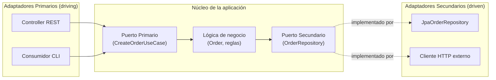

# Arquitectura Hexagonal (Ports & Adapters)

## Origen

La formalizó **Alistair Cockburn** en 2005, con el nombre original de **"Ports and Adapters"** — "Hexagonal" es solo el apodo que se popularizó por cómo se suele dibujar. Un detalle que vale la pena saber para no sobre-pensarlo: **el hexágono no tiene 6 lados por ninguna razón especial de diseño** — Cockburn eligió esa forma simplemente porque le daba espacio visual para dibujar varios "puertos" alrededor del núcleo, sin que la forma geométrica implique nada sobre la arquitectura en sí.

## La misma Regla de Dependencia, otro vocabulario

El objetivo de fondo es idéntico al de [Clean Architecture](./09-clean-architecture.md): el núcleo de negocio no debe depender de detalles externos (frameworks, bases de datos, UI). Lo que cambia es el vocabulario:

- **Puerto (Port):** una interfaz que define un punto de entrada o salida del núcleo de la aplicación.
  - **Puerto primario / driving port:** cómo el mundo exterior *usa* la aplicación (ej. un caso de uso expuesto).
  - **Puerto secundario / driven port:** qué necesita la aplicación *del* mundo exterior (ej. un repositorio, un servicio de email).
- **Adaptador (Adapter):** la implementación concreta de un puerto.
  - **Adaptador primario / driving adapter:** llama hacia adentro (ej. un Controller REST, un consumidor de CLI).
  - **Adaptador secundario / driven adapter:** el núcleo lo llama hacia afuera (ej. un repositorio con JPA, un cliente HTTP).



El núcleo, en el centro, solo conoce los dos puertos (interfaces) — nunca conoce si el adaptador primario es un Controller REST o un CLI, ni si el adaptador secundario es JPA o un cliente HTTP.

## Ejemplo en Kotlin

Nota de contexto: aquí se usa Kotlin en vez de C# porque es habitual encontrar Arquitectura Hexagonal explicada y aplicada en proyectos Kotlin/Spring — vale la pena poder leer el patrón en ambos ecosistemas.

**Núcleo del dominio** (no depende de Spring, ni de JPA, ni de nada externo):

```kotlin
// domain/Order.kt
data class Order(val id: OrderId, val customerId: CustomerId, val total: Money) {
    companion object {
        fun create(customerId: CustomerId, items: List<OrderItem>): Order {
            require(items.isNotEmpty()) { "Un pedido necesita al menos un item" }
            val total = items.sumOf { it.price.amount }
            return Order(OrderId.new(), customerId, Money(total))
        }
    }
}

// domain/OrderRepository.kt — puerto secundario (driven port)
interface OrderRepository {
    fun findById(id: OrderId): Order?
    fun save(order: Order)
}

// domain/CreateOrderUseCase.kt — puerto primario (driving port)
interface CreateOrderUseCase {
    fun execute(customerId: CustomerId, items: List<OrderItem>): OrderId
}
```

**Adaptador secundario** — el núcleo definió qué necesita (`OrderRepository`), esta clase lo implementa con una tecnología concreta:

```kotlin
// infrastructure/persistence/JpaOrderRepository.kt
@Repository
class JpaOrderRepository(
    private val jpaEntityRepository: SpringDataOrderJpaRepository
) : OrderRepository {

    override fun findById(id: OrderId): Order? =
        jpaEntityRepository.findById(id.value).orElse(null)?.toDomain()

    override fun save(order: Order) {
        jpaEntityRepository.save(order.toJpaEntity())
    }
}
```

**Caso de uso** — implementa el puerto primario, depende solo del puerto secundario (interfaz), nunca de `JpaOrderRepository` directamente:

```kotlin
// application/CreateOrderService.kt
@Service
class CreateOrderService(
    private val orderRepository: OrderRepository // el puerto, no el adaptador JPA
) : CreateOrderUseCase {

    override fun execute(customerId: CustomerId, items: List<OrderItem>): OrderId {
        val order = Order.create(customerId, items)
        orderRepository.save(order)
        return order.id
    }
}
```

**Adaptador primario** — un Controller que *usa* el puerto primario para entrar al núcleo desde afuera:

```kotlin
// infrastructure/web/OrderController.kt
@RestController
@RequestMapping("/orders")
class OrderController(
    private val createOrderUseCase: CreateOrderUseCase // el puerto, no el Service concreto
) {
    @PostMapping
    fun create(@RequestBody request: CreateOrderRequest): ResponseEntity<OrderId> {
        val id = createOrderUseCase.execute(request.customerId, request.items)
        return ResponseEntity.status(HttpStatus.CREATED).body(id)
    }
}
```

Nota práctica: en muchos proyectos reales, el `Service` (caso de uso) e implementación del puerto primario terminan siendo la misma clase, como en el ejemplo — separar la interfaz `CreateOrderUseCase` de `CreateOrderService` es opcional y depende de cuánto valor le des a poder mockear el caso de uso en tests del Controller, versus la interfaz extra que hay que mantener. De hecho, a diferencia del puerto secundario (donde la interfaz es indispensable para poder inyectar una implementación distinta), **el puerto primario ni siquiera necesita ser una interfaz para que la arquitectura funcione en runtime** — su valor real es de documentación: deja explícito, con un tipo, cuál es exactamente el límite de la aplicación.

## Mapeo obligatorio en los dos bordes, no solo en el secundario

Ya viste en el [punto 3](../03-diseno-de-apis-y-contratos/) y en el archivo de [N-Tier](./08-arquitectura-en-capas-ntier.md) el patrón DTO para no exponer la entidad de dominio tal cual. En Arquitectura Hexagonal esto no es opcional en un solo borde — es una regla que aplica **en los dos lados del hexágono**:

- **Adaptador primario:** mapea el formato externo (JSON de una petición HTTP) al modelo de dominio, y el resultado del caso de uso a un formato de respuesta — nunca al revés.
- **Adaptador secundario:** mapea el modelo de dominio al formato específico de la tecnología de persistencia (una entidad JPA, una fila de una tabla), y viceversa al leer.

```kotlin
// Adaptador secundario: la entidad JPA es un objeto totalmente distinto al dominio
@Entity
@Table(name = "orders")
class OrderEntity(
    @Id val id: UUID,
    val customerId: UUID,
    val total: BigDecimal
) {
    fun toDomain() = Order(OrderId(id), CustomerId(customerId), Money(total))
}

fun Order.toJpaEntity() = OrderEntity(id.value, customerId.value, total.amount)
```

```kotlin
// Adaptador primario: el DTO de entrada/salida es distinto al dominio
data class CreateOrderRequest(val customerId: UUID, val items: List<OrderItemRequest>)
data class OrderResponse(val id: UUID, val total: BigDecimal)

fun Order.toResponse() = OrderResponse(id.value, total.amount)
```

El costo real de este mapeo (más clases, más código de conversión) solo se justifica cuando la lógica de negocio es lo bastante compleja como para valer la pena aislarla — para un CRUD simple sin reglas de negocio reales, forzar todo este mapeo en los dos bordes es la misma sobre-ingeniería que ya se advirtió en [SOLID y Patrones](./01-solid-y-patrones.md#lo-más-importante-justificado-no-porque-se-puede). Un caso pragmático aceptado incluso por defensores estrictos de esta arquitectura: una consulta de solo lectura, sin ninguna regla de negocio, puede saltarse el dominio y leer directo a un DTO de proyección — la misma idea que ya viste en el archivo de [CQRS](./10-cqrs.md) sobre optimizar lecturas libremente.

## La pirámide de testing en Arquitectura Hexagonal

Esta arquitectura no solo separa el código — separa también en qué nivel se prueba cada cosa, con los puertos como frontera natural de cada tipo de test:

1. **Unit tests del núcleo:** prueban el caso de uso como una caja negra, reemplazando el puerto secundario por un Fake (visto en [Clean Architecture](./09-clean-architecture.md)) — sin Spring, sin base de datos, en milisegundos.

```kotlin
class CreateOrderServiceTest {
    private val fakeRepository = FakeOrderRepository()
    private val service = CreateOrderService(fakeRepository)

    @Test
    fun `crea un pedido y lo guarda`() {
        val id = service.execute(CustomerId.new(), listOf(unItem()))
        assertNotNull(fakeRepository.findById(id))
    }
}
```

2. **Tests de integración del adaptador primario:** levantan el Controller real, pero con el puerto secundario todavía Fake — verifican que el HTTP se traduce bien al dominio, sin pagar el costo de una base de datos real.
3. **Tests de integración del adaptador secundario:** levantan la implementación real (`JpaOrderRepository`) contra una base de datos real en un contenedor (**Testcontainers**), para verificar que el mapeo y las queries funcionan de verdad — esto es lo único que realmente necesita "tocar" la tecnología externa.
4. **Tests end-to-end:** la aplicación completa, wireada de verdad, contra su base de datos real — pocos, y enfocados en el camino feliz principal, no en casos borde (esos ya los cubrieron los tests de nivel 1).

La razón de separar así: los tests de nivel 1 (la mayoría, siguiendo la pirámide de testing del [punto 2](./03-estrategia-de-testing.md)) corren en milisegundos y cubren toda la lógica de negocio real, mientras que los más lentos y caros (3 y 4) se reservan solo para confirmar que el "cableado" con el mundo real efectivamente funciona.

## Cableado explícito vs. contenedor de DI: dos formas válidas de resolver esto

Cómo se conectan los puertos con sus adaptadores concretos varía bastante según el ecosistema, y vale la pena conocer los dos extremos:

- **Spring (con "magia" de reflexión):** anotaciones como `@Service`/`@Repository` más `@ComponentScan` arman el grafo de dependencias automáticamente — el desarrollador nunca escribe el `new`. Para mantener el núcleo de negocio sin ninguna referencia a Spring, un truco real usado en proyectos serios es definir una anotación propia (`@UseCase`) y escanear solo por ella desde el módulo de infraestructura, dejando el módulo de aplicación 100% libre de imports de Spring — incluso el manejo de transacciones se puede aplicar por fuera, con AOP (`@Aspect`), en vez de anotar las clases de negocio con `@Transactional`.
- **Wiring manual explícito (común en Kotlin sin Spring, ej. con Ktor):** una clase simple arma el grafo a mano, con `new`/constructores directos, sin reflexión ni escaneo:

```kotlin
class Dependencies {
    val orderRepository: OrderRepository = JpaOrderRepository(/* ... */)
    val createOrderUseCase: CreateOrderUseCase = CreateOrderService(orderRepository)
}
```

Ninguna de las dos es "la correcta" — es un trade-off real: el contenedor de DI (Spring, o el propio contenedor de ASP.NET Core que ya conoces del [punto 2](./06-inyeccion-de-dependencias.md)) escala mejor a medida que crece el número de dependencias, a cambio de que el grafo completo queda "escondido" detrás de reflexión/anotaciones. El wiring manual es más código repetitivo a mano, pero cada dependencia es 100% explícita y rastreable con solo leer el archivo — nada de "por qué no se inyectó esto" en tiempo de ejecución. El propio contenedor de .NET (`builder.Services.AddScoped<T>()`) queda en un punto intermedio: registro explícito línea por línea (no hay escaneo automático por atributo como en Spring), pero sigue siendo un contenedor que resuelve el grafo en runtime, no wiring 100% manual como en el ejemplo de Kotlin.

## Forzar la regla en el build, no solo con disciplina

La forma más confiable de que la Regla de Dependencia no se rompa por accidente no es "acordarse" — es que el propio proceso de compilación lo impida. En proyectos Gradle/Kotlin esto se ve como dos módulos separados: uno de aplicación (dominio + casos de uso) que **no tiene ninguna dependencia de Spring, JPA, ni de ningún framework** — solo el lenguaje y, como mucho, una librería de testing — y otro de infraestructura que sí depende de frameworks y, además, depende del módulo de aplicación (nunca al revés). Si alguien intenta importar una clase de infraestructura desde el módulo de aplicación, el build directamente no compila.

Esto es exactamente lo mismo que ya viste en la estructura de proyectos .NET del archivo de [Clean Architecture](./09-clean-architecture.md#cómo-se-ve-en-un-proyecto-net-real): `MiApp.Domain` y `MiApp.Application` sin referencia de proyecto hacia `MiApp.Infrastructure`. La diferencia es que en .NET esa restricción se aplica manualmente al no agregar la referencia; en Gradle/Maven o en `dotnet` con paquetes, además se puede reforzar activamente prohibiendo esa dependencia a nivel de gestor de paquetes, para que romperla sea un error de compilación, no solo una convención que alguien puede olvidar.

## Hexagonal vs. Clean Architecture: ¿en qué se diferencian de verdad?

En la práctica, muy poco a nivel de código resultante — ambas terminan separando "núcleo de negocio" de "detalles externos" con inyección de dependencias apuntando siempre hacia el núcleo. La diferencia real está en el **vocabulario y el énfasis**:

- Clean Architecture es más prescriptiva sobre el número de capas (4 círculos: Entities, Use Cases, Interface Adapters, Frameworks & Drivers).
- Hexagonal es más simple en concepto (adentro/afuera, puerto/adaptador) y no impone un número fijo de capas internas.

Es común, y válido, escuchar a un equipo usar ambos términos casi como sinónimos para describir el mismo tipo de estructura de proyecto.

**Precisión sobre el artículo original de Cockburn:** no menciona "capas" en ningún momento — solo distingue "adentro" de "afuera" de la aplicación, y no dice nada sobre cómo organizar el adentro. Esto significa que dentro del núcleo se puede organizar el código como se prefiera (por feature, con patrones de DDD, o incluso con capas tradicionales al estilo N-Tier) sin violar el principio hexagonal — lo único no negociable es que ningún código de "adentro" dependa de nada de "afuera".
