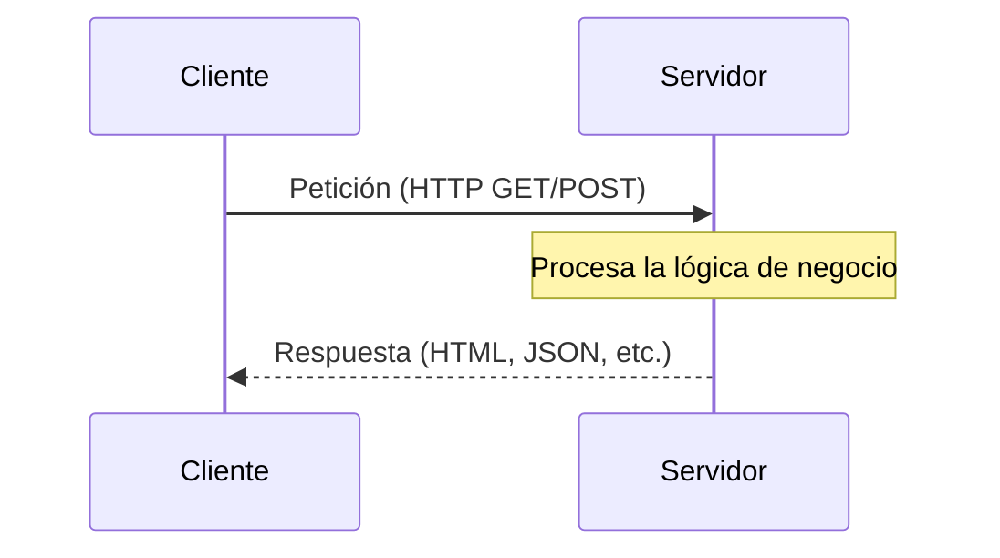
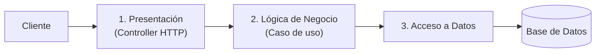

# Cliente-Servidor y Arquitectura en Capas

## El modelo base

Casi toda arquitectura de sistemas moderna es una variación del modelo **cliente-servidor**: un cliente hace una petición, un servidor la procesa y responde. Es tan fundamental que se da por sentado, pero vale la pena nombrarlo explícitamente porque los demás estilos de este punto (SOA, microservicios, eventos) son formas más elaboradas de organizar quién es "cliente" y quién es "servidor" en un sistema con muchas piezas.

## Tipos de cliente

- **Cliente rico (thick client):** tiene lógica de negocio propia y puede funcionar parcialmente sin conexión constante al servidor. Ejemplo: una app de escritorio o una SPA con mucha lógica de validación y estado en el navegador.
- **Cliente ligero (thin client):** casi toda la lógica vive en el servidor; el cliente solo muestra lo que recibe. Ejemplo clásico: una app renderizada 100% en servidor (SSR puro, sin JavaScript de por medio).
- **Cliente mixto/híbrido:** el caso real más común hoy — un frontend con algo de lógica propia (validación de formularios, estado de UI) pero que depende del servidor para todo lo que es fuente de verdad (datos, reglas de negocio). Next.js con Server/Client Components (que ya viste en el [punto 4](../04-arquitectura-frontend-rendimiento-calidad/02-server-client-components.md)) es exactamente este modelo híbrido.

## Arquitectura en capas: cliente-servidor llevado hacia adentro del servidor

La **arquitectura en capas** (layered architecture) es la extensión natural de este modelo hacia el interior del servidor: en vez de tener toda la lógica mezclada en un solo bloque, se organiza en capas horizontales, típicamente:

1. **Presentación:** recibe la petición (un Controller HTTP, por ejemplo).
2. **Lógica de negocio:** valida reglas, orquesta el caso de uso.
3. **Acceso a datos:** habla con la base de datos u otro almacenamiento.

Cada capa solo debería conocer a la capa inmediatamente inferior, nunca saltarse capas ni ir hacia arriba. Esto es, en esencia, el mismo principio que ya viste con mucho más detalle a nivel de código en [Arquitectura y Límites entre Capas](../02-calidad-de-codigo-y-arquitectura/02-arquitectura-y-limites.md) del punto 2 — la diferencia es que aquí se habla de esto como un patrón de organización de **todo un sistema**, mientras que aquella nota lo aplica a la disciplina de escribir código dentro de un proyecto.

## Por qué esto es la base de lo que sigue

Cuando en los siguientes archivos hables de SOA, microservicios o arquitectura orientada a eventos, en el fondo lo que cambia es **cómo se multiplica y distribuye** el modelo cliente-servidor: en vez de "un cliente, un servidor", pasas a tener muchos servidores que a su vez son clientes de otros servidores. Entender bien el modelo base es lo que te permite no perderte cuando la comunicación se vuelve más compleja.
