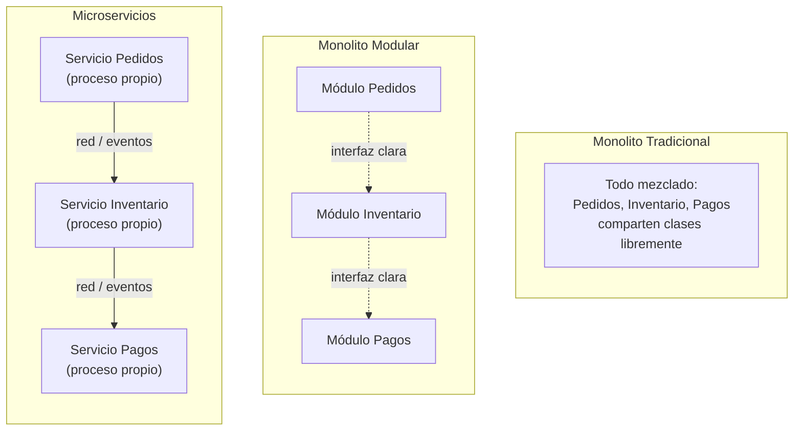

# Monolitos y Monolito Modular

## Qué es un monolito (y qué NO es)

Un monolito es un sistema que se **despliega como una sola unidad**. Eso es todo lo que significa la palabra — no implica que el código esté desorganizado, ni que sea necesariamente "malo". Un monolito puede tener internamente una Clean Architecture perfectamente separada en capas; sigue siendo un monolito porque todo se compila, despliega y escala como un único proceso.

## Ventajas reales

- **Simplicidad operativa:** un solo pipeline de CI/CD, un solo lugar donde buscar logs, sin necesidad de coordinar versiones entre servicios.
- **Sin transacciones distribuidas:** una operación que toca "pedidos" y "inventario" puede vivir en una sola transacción de base de datos ACID, sin necesitar patrones de compensación (Sagas) que sí hacen falta cuando esos dos conceptos viven en servicios separados.
- **Más fácil de depurar:** un stack trace completo de punta a punta, sin tener que reconstruir qué pasó cruzando la red entre 4 servicios distintos (algo que ya viste lo doloroso que puede ser en el [punto 1](../01-autonomia-resolucion-problemas/04-stack-traces.md), incluso dentro de un solo proceso).
- **Desarrollo local simple:** un desarrollador nuevo clona un repo, lo corre, y ya tiene todo el sistema funcionando — no necesita levantar 8 servicios con Docker Compose para poder trabajar en uno solo.

## Desventajas reales

- **Escalado todo-o-nada:** si solo el módulo de reportes necesita más CPU en horas pico, no puedes escalar solo esa parte — escalas el proceso completo, con el desperdicio de recursos que eso implica.
- **Despliegue todo-o-nada:** un cambio de una línea en un módulo obliga a desplegar el sistema completo, con el riesgo de que un bug en un módulo no relacionado tumbe el despliegue de otro.
- **Acoplamiento que crece con el tiempo:** sin disciplina activa, es fácil que con los años el monolito se convierta en un "Big Ball of Mud" (code smell que ya viste en el [punto 2](../02-calidad-de-codigo-y-arquitectura/04-deuda-tecnica.md)) donde todo depende de todo.

## Una afirmación que hay que matizar

Es común escuchar que "en un monolito, si un módulo falla, todo el sistema cae". **Esto no es una propiedad inherente del monolito, es un problema de diseño y manejo de errores.** Un módulo con una excepción no controlada puede tumbar todo el proceso, sí — pero eso pasa exactamente igual en un microservicio mal escrito (tumba ese servicio). Un monolito bien diseñado, con manejo de excepciones adecuado, límites de módulo claros y operaciones async con sus propios boundaries de error, no necesariamente cae completo porque un módulo específico falle. Confundir esto lleva a elegir microservicios pensando que resuelven un problema de resiliencia que en realidad es un problema de calidad de código, no de estilo arquitectónico.

## Monolito Modular: el término medio real

El **monolito modular** es un solo deployable (sigue siendo un monolito), pero organizado internamente en módulos con límites explícitos y fuertes — cada módulo con su propio "espacio" de datos y una interfaz clara hacia los demás, como si fueran servicios, pero sin la complejidad operativa de desplegarlos por separado.

Los tres despliegan como una sola aplicación... excepto Microservicios, que despliega cada pieza por separado. La diferencia real entre Monolito Tradicional y Monolito Modular no está en el despliegue (ambos son un solo deployable) sino en si existe o no una interfaz clara entre módulos — el mismo criterio de límites que ya viste en el punto 2.

Esto no es una idea nueva separada de lo que ya estudiaste: Clean Architecture y Arquitectura Hexagonal (punto 2) son exactamente las técnicas que usarías **dentro** de un monolito modular para lograr esos límites duros entre módulos. Un monolito modular bien hecho es, en la práctica, un conjunto de "futuros microservicios" que todavía no necesitan separarse — y si algún día sí hace falta, la migración es mucho más simple porque los límites ya existen en el código, solo hay que moverlos a procesos separados (esto se conoce como el patrón **Strangler Fig**: migrar gradualmente pieza por pieza, en vez de reescribir todo de golpe).

La recomendación real de la industria (popularizada por Martin Fowler con el término "Monolith First") es empezar con un monolito modular casi siempre, y migrar partes a servicios separados solo cuando un NFR concreto (escala, disponibilidad, equipos que necesitan desplegar independientemente) lo justifique — no por moda.
