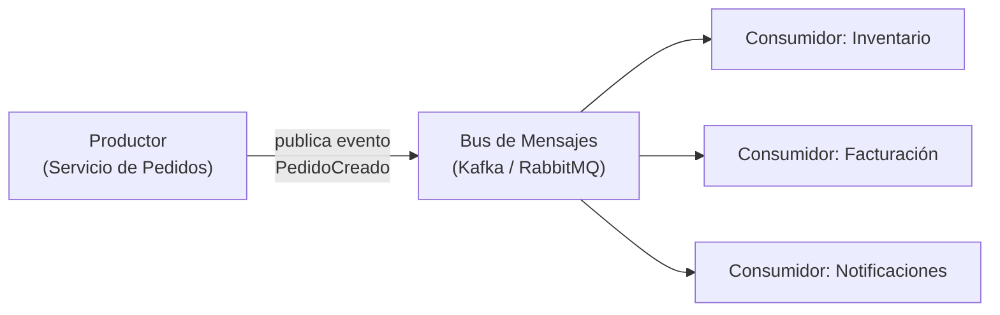
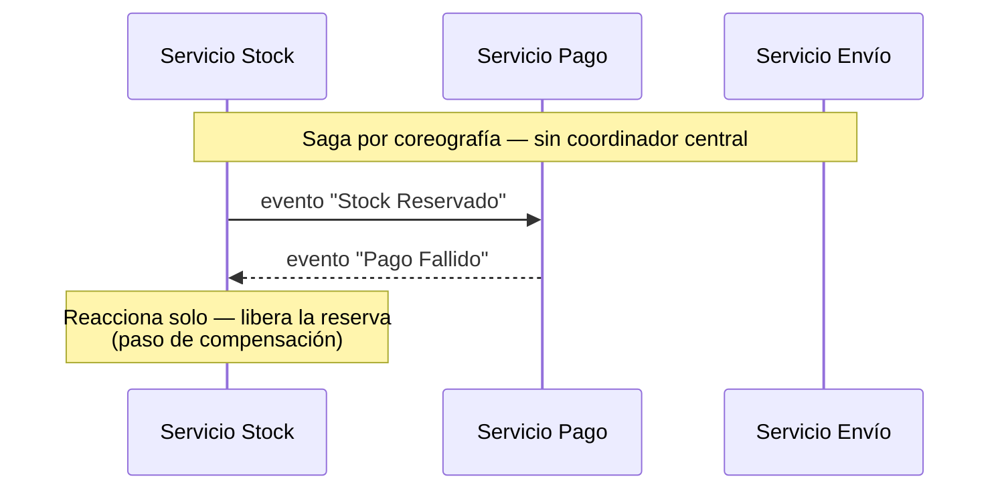

# Arquitectura Orientada a Eventos (Event-Driven Architecture)

## La idea central

En vez de que un servicio llame directamente a otro y espere su respuesta (como en cliente-servidor clásico), en una arquitectura orientada a eventos un servicio **publica un evento** ("Pedido Creado", "Pago Confirmado") sin saber ni importarle quién lo va a consumir. Otros servicios, si les interesa ese evento, se suscriben y reaccionan cuando ocurre.

## Las piezas del modelo

- **Productor (producer):** el servicio que genera el evento cuando algo relevante sucedió.
- **Bus de mensajes / broker:** la infraestructura que recibe el evento y lo entrega a quien esté suscrito (ejemplos reales: **Kafka**, **RabbitMQ**, Azure Service Bus, AWS SNS/SQS).
- **Consumidor (consumer):** el servicio que reacciona al evento — puede haber uno o varios consumidores para el mismo evento, y el productor no necesita saber cuántos ni quiénes son.

La diferencia clave frente a cliente-servidor: el productor **no espera respuesta**. Publica el evento y sigue con lo suyo — desacopla en el tiempo a quien genera el evento de quien lo procesa.

El Productor publica una sola vez, sin saber (ni importarle) que hay 3 consumidores distintos reaccionando al mismo evento.

## El rol de Domain-Driven Design (DDD) aquí

Cuando un sistema se divide en varios servicios que se comunican por eventos, surge una pregunta: ¿dónde está el límite entre un dominio y otro? Aquí es donde entra **DDD**, específicamente su concepto de **Bounded Context** (contexto delimitado): cada servicio/dominio tiene su propio modelo y su propio lenguaje, y un mismo término (ej. "Cliente") puede significar cosas distintas en el dominio de Ventas que en el de Soporte. Los eventos son la forma en la que estos contextos delimitados se comunican sin forzar un modelo único y compartido para todo el sistema (que sería frágil y crecería sin control). DDD es un tema amplio que merece su propio estudio dedicado más adelante — aquí solo se menciona su rol específico en delimitar qué eventos publica y consume cada servicio.

## Retos reales de este estilo (no es gratis)

- **Consistencia eventual, no inmediata:** cuando un pedido se crea, el servicio de inventario puede tardar unos segundos (o más) en enterarse y descontar stock. Durante esa ventana, los dos servicios están "desincronizados" — hay que diseñar la UI y la lógica de negocio asumiendo esto, no asumiendo consistencia instantánea como en una sola base de datos transaccional.
- **Transacciones distribuidas — patrón Saga:** si una operación de negocio necesita tocar 3 servicios distintos (reservar stock, cobrar el pago, generar el envío) y uno falla a mitad de camino, no existe un `ROLLBACK` único como en una base de datos. El patrón **Saga** resuelve esto definiendo pasos de compensación explícitos (si el pago falla después de reservar stock, se publica un evento que libera esa reserva) — hay dos variantes: coreografía (cada servicio reacciona a eventos de los demás, sin un director central) y orquestación (un coordinador central decide el orden de los pasos).

- **Lenguaje ambiguo entre dominios:** si dos equipos interpretan el mismo evento de forma distinta (ej. qué significa exactamente "Pedido Cancelado"), aparecen bugs muy difíciles de rastrear porque cada lado del sistema "tiene razón" según su propia interpretación del contrato del evento.
- **Debugging más difícil:** rastrear qué pasó realmente cuando algo falla implica reconstruir una cadena de eventos a través de varios servicios y un broker — mucho más difícil que seguir un stack trace dentro de un solo proceso (esto conecta directamente con lo que ya viste sobre trazabilidad en el [punto 1](../01-autonomia-resolucion-problemas/03-interpretacion-de-logs.md): el **Correlation ID** deja de ser opcional en este estilo, es prácticamente obligatorio para poder seguir una operación de negocio a través de múltiples servicios).

## Cuándo tiene sentido

Cuando hay operaciones de negocio que naturalmente no necesitan una respuesta inmediata y síncrona (notificaciones, actualizaciones de reportes, sincronización entre sistemas), o cuando varios servicios necesitan reaccionar a lo mismo sin que el productor tenga que conocerlos a todos explícitamente. No tiene sentido para operaciones donde el usuario necesita una confirmación inmediata y sincrónica del resultado (ej. "¿se procesó mi pago sí o no, ahora mismo?").
