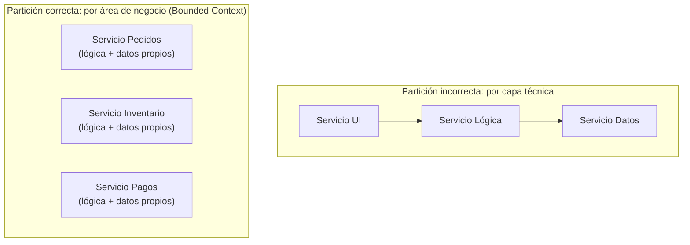
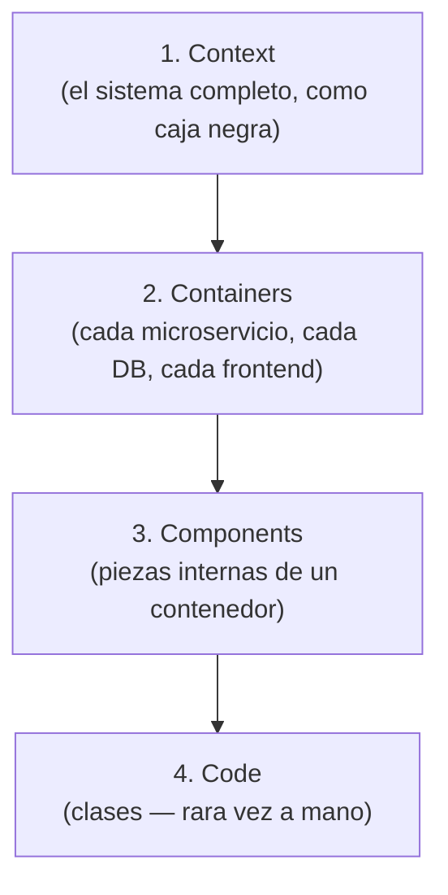

# Microservicios: Ventajas y Costos Ocultos

## Qué son, en una frase

Un sistema dividido en servicios pequeños, cada uno con su propia base de datos, desplegable de forma independiente, comunicándose por red (HTTP/gRPC/eventos) en vez de por llamadas de función en memoria.

## Cómo delimitar cada microservicio: por área de negocio, no por capa técnica

Antes de las ventajas y costos, hay una pregunta previa que decide si todo lo demás funciona bien: **¿dónde se traza el límite entre un microservicio y otro?**

Hay una forma equivocada, bastante común en implementaciones inmaduras: dividir por **capa técnica** — un "servicio de UI", un "servicio de lógica", un "servicio de base de datos". Esto no resuelve nada; solo reemplaza las llamadas en memoria de una arquitectura en capas por llamadas de red, sin ganar independencia real, porque las tres siguen teniendo que desplegarse juntas para que cualquier cambio funcione.

La forma correcta, y la que describe la experiencia real de un microservicio por área de negocio (Pedidos, Inventario, Pagos, Facturación, cada uno con lógica de negocio propia importante) es dividir por **capacidad de negocio** — lo que en DDD se llama **Bounded Context** (ya mencionado en el archivo de [Arquitectura Orientada a Eventos](./05-arquitectura-orientada-a-eventos.md)). Cada servicio es dueño de punta a punta de un área completa: su propia lógica, sus propios datos, su propio ciclo de despliegue. Esto es exactamente lo que describe Sam Newman en *"Building Microservices"* como el criterio recomendado de partición, y es el estándar de la industria — no una improvisación.

**El matiz que agrega valor real (y que confirma un buen criterio):** no todas las áreas de negocio necesitan ser su propio servicio. Si un área es CRUD simple sin reglas de negocio complejas, separarla como microservicio propio agrega el costo operativo completo (pipeline, monitoreo, base de datos propia) sin ganar nada — es el antipatrón de **"nanoservicios"**: demasiados servicios diminutos, cada uno más caro de operar que el valor que aporta estar separado. El criterio de "microservicio solo si el área tiene lógica de negocio importante" es exactamente el filtro correcto — separar por Bounded Context real, no por el simple hecho de que técnicamente se pueda separar cualquier cosa.

En la partición incorrecta, cualquier cambio de negocio sigue obligando a tocar los 3 servicios a la vez (siguen acoplados, solo que ahora por red). En la partición correcta, un cambio en las reglas de Pagos no obliga a tocar Pedidos ni Inventario.

## Ventajas reales

- **Despliegue independiente:** el equipo de "Pagos" puede desplegar un cambio sin coordinar con el equipo de "Inventario", ni arriesgar que un bug en inventario tumbe el despliegue de pagos.
- **Libertad tecnológica:** cada servicio puede usar el lenguaje/stack que mejor le sirva (un servicio de recomendaciones en Python por sus librerías de ML, el resto en .NET) — aunque en la práctica, la mayoría de equipos limita esta libertad a propósito para no multiplicar el costo de mantenimiento de conocer 5 stacks distintos.
- **Escalado selectivo:** si el servicio de búsqueda recibe 10 veces más tráfico que el resto, se escala solo ese servicio, sin desperdiciar recursos escalando todo el sistema.
- **Límites de dominio forzados:** al estar en procesos separados, es mucho más difícil "hacer trampa" y acoplar dos dominios que no deberían conocerse — la separación física obliga a una separación de responsabilidades que en un monolito depende solo de la disciplina del equipo.

## Los costos que casi nunca se mencionan de entrada

- **Complejidad operativa multiplicada:** en vez de un pipeline de CI/CD, tienes uno por servicio. En vez de un lugar donde ver logs, necesitas centralizarlos de varios servicios — la observabilidad (logging estructurado, métricas, trazas — punto 8 del roadmap, todavía pendiente de documentar) pasa de ser deseable a ser obligatoria en microservicios.
- **Tracing distribuido:** cuando una petición cruza 5 servicios, un stack trace normal no alcanza — hace falta instrumentación de **distributed tracing** (ej. OpenTelemetry) con un Correlation ID/Trace ID que viaje entre todos los servicios, solo para poder reconstruir qué pasó.
- **Latencia y costo de red:** una llamada en memoria dentro de un monolito tarda nanosegundos y no cuesta nada; la misma llamada entre dos microservicios cruza la red, tiene latencia real, puede fallar de formas que una llamada en memoria nunca falla (timeout, servicio caído, DNS), y en la nube, el tráfico de red entre servicios frecuentemente tiene costo monetario directo.
- **Consistencia de datos:** cada servicio con su propia base de datos significa que ya no hay una transacción ACID que abarque todo — aparece la necesidad de Sagas y consistencia eventual, exactamente como se explicó en el archivo de [Arquitectura Orientada a Eventos](./05-arquitectura-orientada-a-eventos.md).
- **Costo de equipo y madurez operativa:** microservicios asumen que el equipo ya tiene práctica sólida en contenedores, orquestación (Kubernetes o similar), CI/CD maduro y observabilidad — adoptar microservicios sin esa base primero suele significar construir esa madurez operativa *a la vez* que se construye el producto, lo cual es mucho más lento y riesgoso que hacerlo por separado.

## Herramienta útil para visualizar sistemas distribuidos: el Modelo C4

Cuando un sistema tiene varios servicios, un solo diagrama ya no alcanza para explicarlo con claridad a distintas audiencias. El **Modelo C4** (Simon Brown) propone 4 niveles de diagrama, cada uno con más detalle que el anterior:

1. **Context:** el sistema completo como una caja negra, y con qué otros sistemas/usuarios interactúa.
2. **Containers:** los "contenedores" desplegables del sistema (cada microservicio, cada base de datos, cada frontend) y cómo se comunican.
3. **Components:** dentro de un contenedor específico, sus componentes internos principales.
4. **Code:** el nivel de detalle de clases/código (rara vez se dibuja a mano, normalmente se genera desde el IDE si hace falta).

Para un sistema de microservicios, el diagrama de **Containers** suele ser el más útil para dar contexto rápido a alguien nuevo en el equipo.

## Cuándo NO usar microservicios

Cuando el equipo es pequeño, el dominio del negocio todavía no está bien entendido (dividir en servicios antes de conocer bien los límites del dominio real casi garantiza límites mal puestos, que después son muy caros de corregir porque implican mover código *entre* procesos, no solo entre archivos), o cuando ninguno de los NFR reales (visto en el primer archivo de este punto) exige la escala o independencia de despliegue que los microservicios ofrecen. Elegir microservicios sin esas condiciones es el mismo error de fondo que YAGNI señala en el punto 2: pagar complejidad hoy por una necesidad que quizás nunca llegue.
